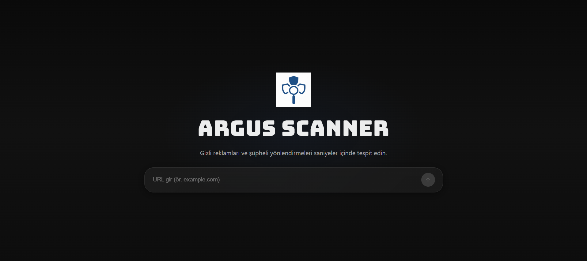
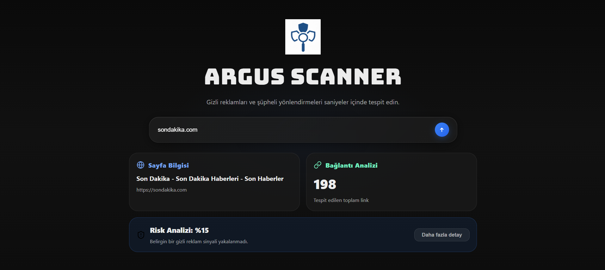
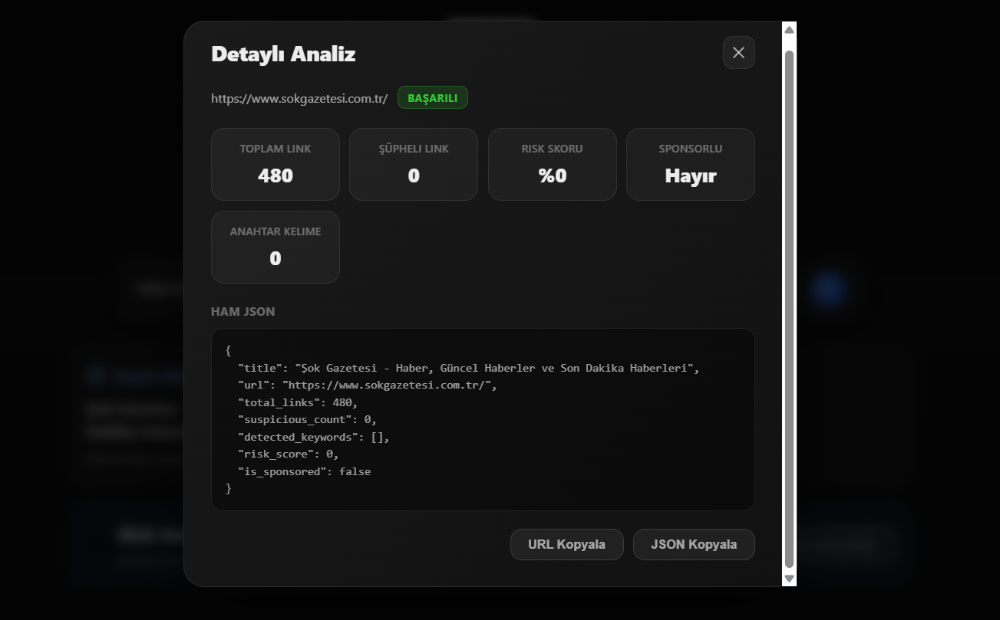

# Argus Scanner

Argus Scanner is a web analysis tool that helps detect hidden ad signals and suspicious redirect behavior on a given URL by running an automated scan and returning a clear risk summary plus technical details.

> **UI Language:** The website/application interface is **Turkish**.  
> **Mobile Note:** The UI is **not fully mobile responsive** yet (mobile responsiveness improvements are planned).

---



## Features

- URL scanning via **Django REST Framework** + **Selenium** (undetected-chromedriver)
- Link analysis:
  - Total link count
  - Suspicious/affiliate link signals (`suspicious_count`)
- Keyword detection for disclosure/sponsorship indicators
- Risk scoring (0–100) and a simple “sponsored risk” flag
- Structured API error responses:
  - `error`, `error_code`, `details` (trimmed for UI)
- Full-screen “More details” modal:
  - Metrics summary
  - Keyword chips
  - Raw JSON output + copy buttons

---





## Monorepo Structure

- `API/` — Django REST API + Selenium scanner
- `Client/` — React + TypeScript + Vite frontend

---

## Requirements

- **Python** 3.12+
- **Node.js** 18+ (recommended)
- **Google Chrome** installed (used by Selenium/undetected-chromedriver)

---

## Setup

### Backend (API)

```powershell
cd API
python -m venv venv
.\venv\Scripts\Activate.ps1
pip install -r requirements.txt
```

Run the server:

```
.\venv\Scripts\python.exe manage.py runserver --noreload --nothreading
```

Backend URL:

http://127.0.0.1:8000

Frontend (Client)

```
cd Client
npm install
npm run dev
```

Frontend URL (Vite default):

http://localhost:5173

Usage

- Start the backend server.

- Start the frontend dev server.

- Open the frontend in your browser and enter a URL to scan.

API

```
POST /api/analyze/
```

Request body:

```
{ "url": "example.com" }
```

Success response example:

```
{
"title": "Example Domain",
"url": "https://example.com",
"total_links": 1,
"suspicious_count": 0,
"detected_keywords": [],
"risk_score": 0,
"is_sponsored": false
}
```

Error response example:

```
{
"error": "Failed to load the page.",
"error_code": "page_load_error",
"details": "net::ERR_NAME_NOT_RESOLVED"
}
```

Environment Variables (Backend)

These variables help improve Selenium stability and control behavior:

ARGUS_HEADLESS

- 1 (default): run headless
- 0: run GUI (debug)

ARGUS_ALLOW_GUI_FALLBACK

- 0 (default): never open a visible Chrome window
- 1: allow GUI fallback once (debug)

ARGUS_CHROME_MAJOR

- Chrome major version (e.g., 145) to improve driver compatibility

ARGUS_HEADLESS_RETRIES

- Number of headless retries on “window crash” errors (default: 2)

PowerShell example:

```
$env:ARGUS_HEADLESS="1"
$env:ARGUS_ALLOW_GUI_FALLBACK="0"
$env:ARGUS_CHROME_MAJOR="145"
$env:ARGUS_HEADLESS_RETRIES="2"
```

## Known Limitations

- Some heavy websites (ads/anti-bot scripts) may occasionally fail in headless mode depending on environment and browser version.

- The UI is not fully mobile responsive yet.
